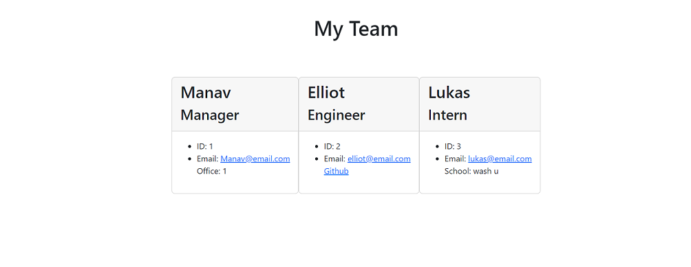

# employee-tracker

## Description

This is a command-line application that allows the user to generate and view their company's teams.

## Table of Contents

* [Mock-Up](#mock-up)
* [Installation](#installation)
* [Usage](#usage)
* [Tests](#tests)
* [Author](#author)

## Mock-Up

The following displays the generated html page:



Here is a video walkthrough of the application:

https://drive.google.com/file/d/1S-u6UxHc3m_ss1T5CIkgRwdVVtifGlGt/view

## Installation

To use this application you will need to install some dependencies using the following command:

```bash
npm install
```

## Usage

This app is to help a user keep track of a small group of employees and their roles! Once the team is generated, the user can view the team in the browser.

## Tests

This application has been tested using Vitest. To run the tests, use the following command:

```bash
npm run test
```
You will see that all tests pass.

## Author

Elliot Baynes is an aspiring developer hard at work honing his skills in web development as well as diversifying into game development. Currently, he is working on a D&D random encounter and loot generator, as well as a VR game for the Oculus! Check out his Github here: [Elliot Baynes](https://github.com/eabaynes).